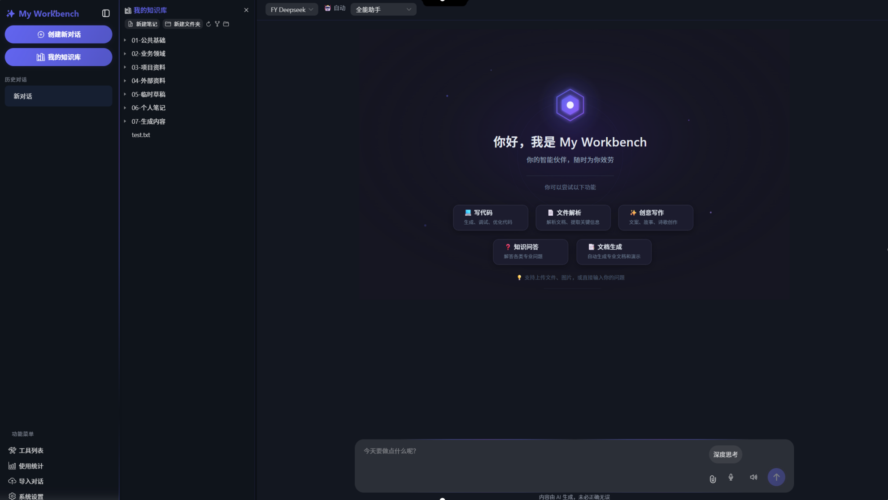
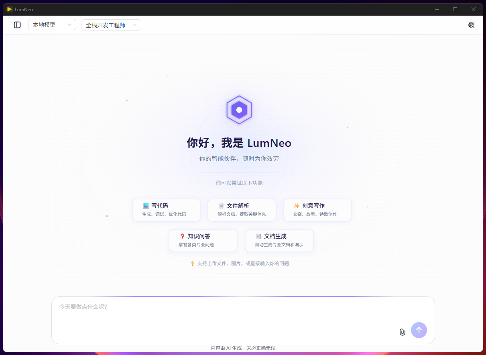
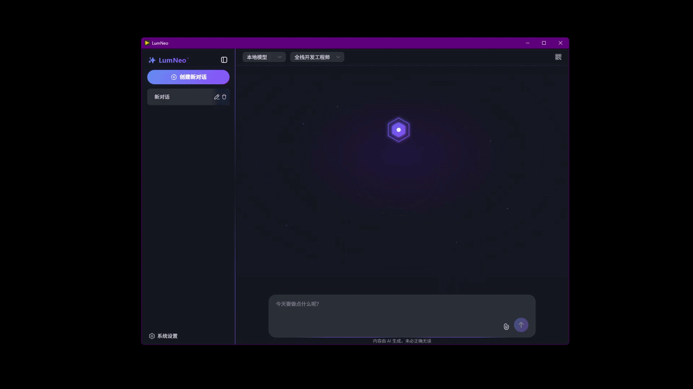

#  My Workbench — 点亮灵感的 AI 桌面伙伴


> 不是冰冷的工具，是悄悄懂你的那束光 (◕ᴗ◕✿)

My Workbench 是一款跨平台 AI 桌面应用，将**本地隐私**与**云端算力**融为一体。它不只是对话框，更是可自由塑造的**智能体工作台**——支持多角色切换、文件读写解析、MCP 工具扩展、可编程技能系统与本地知识库 RAG，让每个想法都有专属的执行者。界面现代优雅，桌面与移动端均完美适配，让 AI 协作如呼吸般自然。

<p align="center">
  
  
</p>
<p align="center">
  
</p>

---

##  为什么选择 My Workbench？

###  万千角色，一键切换
- **自由创建专属角色**：定义独特人格、Prompt 与能力边界
- **独立工具绑定**：为每个角色配置专属 MCP 服务与本地工具白名单
- **无缝切换**：上一秒是代码审查员，下一秒变文案编辑，专业的人做专业的事

###  文件读写，如臂使指
- **拖拽即解析**：图片供视觉模型理解，文档自动提取结构与细节
- **直接写入结果**：提出修改需求后，AI 可直接生成并保存文件，无需手动复制粘贴

###  双擎驱动，懂你所想
- **本地模型**：Ollama / LM Studio 离线运行，隐私数据不出本机
- **云端大模型**：OpenAI / DeepSeek 等一键接入，破解复杂难题
- **思考过程透明**：推理内容可折叠展示，思考耗时一目了然

###  MCP 生态，无限延伸
- 动态工具调用，内置文件读写、目录创建、天气查询等常用能力
- 支持自定义 MCP 服务器（stdio / SSE / streamable-http），打破桌面应用孤岛

###  智能体引擎，坚实可靠
- **Human-in-the-Loop**：`system_ask_user` 工具允许 AI 在关键操作前暂停向用户提问；工具审批流可在执行前拦截敏感工具调用，前端弹窗 + WebSocket 实时回传审批结果
- **自主规划与委派**：`system_delegate_task` 将复杂子任务委派给独立上下文 + 受限工具集的子智能体，支持递归分解，防无限循环
- **多 Agent 角色协作**：支持单 Agent、链式（sequential）和并行（parallel）三种协作模式，可为每个子 Agent 定义角色名、目标和背景故事，支持 Crew 模板一键复用
- **并行工具调用**：多个独立工具自动并行执行，延迟从 N×t 降到 max(t)
- **流式工具执行**：模型边生成 tool_call 边执行，不再"全生成完才执行"
- **模型容错降级**：API 失败自动重试（指数退避），支持 fallback 备用模型切换
- **Prompt Caching**：系统提示词+工具定义按序排列，最大化 DeepSeek 前缀缓存命中
- **上下文自动压缩**：长对话超阈值自动生成摘要，防止 token 溢出

###  Agent 可观测性，透明可控
- **Span 级执行追踪**：每次 Agent 执行自动生成 Trace + Span 树，记录每步 LLM 调用、每个工具调用的耗时与输入输出
- **瀑布图可视化**：前端 Trace Panel 以时间线瀑布图展示 Agent 执行全过程，按类型着色（step/tool_call/sub_agent/approval）
- **规划步骤卡片**：复杂任务的 Todo 计划以进度卡片形式内联展示，步骤状态（待执行/执行中/已完成）实时更新

###  技能系统，可编程的能力包
- **两类技能**：`prompt` 型（提示词 + 工具白名单，人人可建）与 `code` 型（可执行 Python 脚本，仅管理员可建）
- **可视化管理**：界面内注册、编辑、启用/禁用、删除技能，保存后**热重载**即时生效，无需重启
- **智能选择**：根据用户问题语义自动匹配最相关的 Top-K 技能注入系统提示词，减少 Token 消耗
- **一键分享迁移**：技能可导出/导入为 `.zip` 包（`SKILL.md` frontmatter + 可选 `skill.py`），对齐 Claude Agent Skills 习惯
- **绑定到角色**：为不同角色勾选技能，`prompt` 型自动注入指令并展开工具白名单，`code` 型作为可被 LLM 调用的 function
- **受限沙箱**：`code` 型在白名单内建 + 白名单 import 的受限命名空间中执行，支持上下文隔离；身份分级（admin / user）划分创建权限

###  我的知识库，双链 + 语义检索
- **本地笔记管理**：选定任意目录作为知识库，界面内浏览目录树、读写 Markdown、增删文件夹（兼容 Obsidian 仓库）
- **Obsidian 式双链**：`[[笔记名]]` 输入即补全、点击即跳转，笔记底部自动汇总「反向链接」
- **知识图谱**：力导向可视化笔记关系网络，拖拽 / 缩放 / 双击打开，未创建的笔记以虚节点提示
- **RAG 语义检索**：本地 Ollama 或云端 OpenAI 双引擎向量化，AI 在对话中先语义命中相关笔记再精读
- **全文关键词搜索**：SQLite FTS5 引擎驱动的关键词搜索，与语义检索互补，支持混合模式精准命中
- **引用溯源**：检索结果附带引用 ID，AI 回答中自动标注来源，点击引用标签直达源文件对应位置
- **增强文档解析**：支持 OCR 识别扫描件/图片文字；PDF 表格结构化提取；布局感知分块保留表格与代码块完整性
- **标签系统**：为知识库文件自定义标签（创建、删除、按标签筛选文件），多维分类管理笔记
- **网页一键入库**：`system_web_fetch` 工具可将任意网页内容抓取后保存为知识库笔记，扩展知识边界

### ️ WebSocket 双向通信，实时即正义
- **WS 对话通道**：`/ws/chat` 端点，模型输出逐 token 推送，延迟更低
- **即时取消**：发送 `cancel` 消息立即中断当前生成，无需等待 HTTP 超时
- **工具审批实时回传**：前端审批弹窗 → WebSocket 回传结果，阻塞的工具调用即刻恢复执行

###  细节之处，皆是温度
- **流式对话 + 富文本**：回复逐字浮现，Markdown 实时渲染，代码高亮 + Mermaid 图表
- **主题自定义**：自由调节主题色（取色器）、圆角半径、字号，实时预览所见即所得
- **暗色 / 浅色主题**：炫酷边框微光、果冻弹性动效，视觉舒适不疲劳
- **统计仪表板**：Token 消耗趋势图、对话统计，用量一目了然
- **会话管理**：新建、重命名、删除对话，历史消息持久化存储；支持会话导出/导入（Markdown / JSON / ZIP）、对话分叉（从任意消息处分支新对话）
- **Token 用量统计**：每次对话消耗一目了然，支持随时停止生成

### ️ 语音交互，开口即用
- **语音输入**：浏览器原生 `SpeechRecognition`，Chrome/Edge 内置，无需 API
- **语音朗读**：浏览器原生 `speechSynthesis`，AI 回复自动朗读
- **零配置**：纯浏览器端完成，不依赖任何语音模型 API

###  跨会话记忆，越用越懂你
- **自动索引**：AI 回复完成后自动向量化存入会话记忆库
- **语义召回**：新对话开始时自动检索相关历史记忆，注入系统提示词
- **隐私优先**：记忆存储在本地 SQLite 向量表，不出本机

###  知识库自动同步
- **文件监听**：后台轮询检测知识库文件变更（新增/修改/删除）
- **自动增量索引**：变更后 30s 内自动触发增量索引，RAG 始终最新
- **去抖合并**：快速连续变更在 5s 窗口内合并批次，避免重复索引

---

##  项目愿景与路线图

My Workbench 不仅仅是一个生产力工具，还准备打造一个不断进化的**数字生命体**。

| 阶段 | 版本 | 核心目标 | 状态 |
| :--- | :--- | :--- | :--- |
| **Phase 1** | **v1.0** | **极致生产力底座**<br>实现多模态交互基础，开放 MCP 接口生态，打造轻量级本地 AI 助手。 |  ✅ |
| **Phase 2** | **v2.0** | **进化为”数字生命体”**<br>赋予 AI 长期记忆、个性化性格与主动服务能力，让它从工具变为真正的伙伴。<br>*（已落地：RAG+引用溯源+OCR、Span追踪+计划可视化、多Agent协作、Skill智能选择）* | ✅ |
| **Phase 3** | **Future** | **打破虚实边界**<br>接入多模态感知（视觉、语音）与 IoT 硬件控制，实现真正的 AIoT 智能交互（现实版贾维斯）。 |  规划中 |

---

##  技术栈

| 层级 | 技术选型 | 说明 |
|------|----------|------|
| 桌面容器 | PyWebView | 轻量级原生窗口封装，启动快、资源占用低 |
| 前端框架 | Vue 3 + TypeScript + Naive UI + Vite | 现代化响应式界面，组件化开发 |
| 后端 API | FastAPI (异步) + WebSocket + SQLite (aiosqlite) | 高性能异步接口 + 双向实时通信，本地数据持久化 |
| 模型调用 | openai 库 | 统一兼容 OpenAI / Ollama / LM Studio 等主流协议 |
| 工具扩展 | MCP SDK (fastmcp) | 支持 stdio / SSE / streamable-http 三种传输方式 |
| 技能系统 | 受限 exec 沙箱 + PyYAML + zipfile | prompt / code 双类技能，SKILL.md 包导入导出 |
| 知识库检索 | sqlite-vec + FTS5 + numpy | 向量语义检索 + 全文关键词搜索 + 引用溯源，标签多维分类，全部本地 SQLite |
| 文档解析 | markitdown + pytesseract + pdfplumber + PyPDF2 | OCR 识别、PDF 表格提取、图片/Word/PDF/Excel 等多格式内容提取 |
| 可观测性 | Span 追踪 + Trace 面板 + 计划可视化 | Agent 执行全链路追踪、瀑布图时间线、步骤进度卡片 |
| 渲染增强 | marked + highlight.js + mermaid | 完整 Markdown 生态，代码与图表原生支持 |
| 语音交互 | Web Speech API (SpeechRecognition + SpeechSynthesis) | 浏览器原生语音输入/朗读，零 API 依赖 |
| 容错降级 | 指数退避重试 + fallback 模型切换 | API 故障自动恢复，保障服务连续性 |
| 上下文管理 | 自动摘要压缩 + Prompt Cache 优化 | 长对话不爆 token，重复前缀节省费用 |
| 打包分发 | PyInstaller | 跨平台一键构建可执行文件 |

---

##  项目主要结构

```text
My Workbench/
├── app_config.yaml           # 应用配置文件
├── build.bat                 # Windows 一键构建脚本
├── config_loader.py          # 配置加载（开发 / 打包环境路径适配）
├── main.py                   # 应用入口（启动 FastAPI + PyWebView）
├── requirements.txt          # Python 依赖清单
├── system_prompt.md          # 系统内置角色 Prompt 模板
├── tools_config.yaml         # 本地工具配置文件
├── mcp_config.json           # MCP 服务器配置文件（运行时自动创建）
├── .venv/                    # Python 虚拟环境（开发用，gitignore）
├── data/                     # 运行时数据目录（gitignore）
│   ├── lumneo.db             # SQLite 数据库（聊天、角色、技能、RAG 等）
│   ├── uploads/              # 用户上传文件存储
│   └── generate/             # 智能体生成产物（如 .pptx 等）
├── workspace/                # 智能体工作区（gitignore）
│   └── slides/               # PPT 编译工作区示例
├── temp/                     # 临时文件（gitignore）
├── logs/                     # 运行日志（gitignore）
├── screenshots/              # 截图素材
├── backend/
│   ├── __init__.py           # 工作区路径、知识库默认路径
│   ├── bootstrap.py          # 日志与运行环境初始化
│   ├── database.py           # SQLite 表结构初始化与迁移
│   ├── mcp_client.py         # MCP 客户端管理器（多角色工具隔离）
│   ├── db/
│   │   ├── kb_settings.py    # 知识库 embedding 配置读写（app_settings）
│   │   ├── kb_chunks.py      # RAG 分片元数据与索引状态
│   │   ├── vec_store.py      # sqlite-vec 向量库封装（存取 / KNN 检索）
│   │   ├── skills.py         # 自定义技能（prompt / code）持久化
│   │   ├── tool_calls.py     # 工具调用记录
│   │   └── user_settings.py  # 本机身份（admin / user）等用户设置
│   ├── routes/
│   │   ├── __init__.py       # 路由注册入口
│   │   ├── chat.py           # 聊天接口（流式输出、工具调用）
│   │   ├── ws_chat.py        # WebSocket 聊天端点（双向通信、即时取消、审批回传）
│   │   ├── chats.py          # 对话 CRUD + 导出/导入（Markdown / JSON / ZIP）
│   │   ├── files.py          # 文件上传 / 解析接口
│   │   ├── model.py          # 当前模型读写接口
│   │   ├── models.py         # 模型列表 / 配置接口
│   │   ├── profiles.py       # 角色 CRUD（含工具与技能绑定）
│   │   ├── mcp.py            # MCP 服务前台配置与热连接
│   │   ├── workspace.py      # 工作区目录设置
│   │   ├── toolcalls.py      # 工具调用记录接口
│   │   ├── skills.py         # 技能 CRUD / 启停 / 导入导出 / 身份
│   │   ├── knowledge.py      # 知识库文件浏览 / 读写 / 增删
│   │   ├── kb_rag.py         # embedding 配置、索引管理、语义搜索、图谱、反链
│   │   └── voice.py           # 语音 STT/TTS API（OpenAI 兼容，可选增强）
│   ├── services/
│   │   ├── llm_service.py    # 大模型调用服务（含工具循环、重试降级、流式执行）
│   │   ├── embedding.py      # 可配置 embedding 层（Ollama / OpenAI 双引擎）
│   │   ├── context_compressor.py  # 长对话上下文自动摘要压缩
│   │   ├── kb_indexer.py     # 知识库切片与增量索引引擎
│   │   ├── kb_watcher.py     # 知识库文件监听器（自动增量索引）
│   │   ├── kb_graph.py       # 双链解析与知识图谱构建
│   │   ├── session_memory.py # 会话记忆向量化（跨对话语义检索）
│   │   ├── skills.py         # 技能注册表与受限沙箱执行引擎（热重载）
│   │   ├── skill_package.py  # SKILL.md 技能包解析与打包
│   │   ├── chat_export.py    # 会话导出/导入服务（Markdown / JSON / ZIP 格式）
│   │   └── tools.py          # 本地工具动态导入定义与执行引擎
│   ├── system_tools/         # 系统内置工具（供 LLM 调用）
│   │   ├── reader.py         # 文件读取与解析
│   │   ├── writer.py         # 文件写入
│   │   ├── file_lister.py    # 目录列举
│   │   ├── project_creator.py# 目录树文本一键建项目
│   │   ├── kb_reader.py      # 知识库只读工具（浏览 / 读取笔记）
│   │   ├── kb_search.py      # 知识库语义检索工具
│   │   ├── runner.py         # 命令执行工具
│   │   ├── delegate.py       # 子智能体委派工具
│   │   ├── ask_user.py       # Human-in-the-loop 用户提问/审批工具
│   │   ├── web_fetch.py      # 网页抓取→知识库工具
│   │   ├── todo.py           # 任务清单管理工具
│   │   └── weather.py        # 天气查询示例工具
│   └── utils/
│       ├── base.py           # 路径工具函数
│       └── validators.py     # 路径安全校验
├── frontend/                 # Vue 3 前端
│   ├── package.json
│   ├── vite.config.ts        # Vite 配置（代理 / 分包 / 别名）
│   ├── tsconfig.json
│   ├── public/
│   │   ├── favicon.ico
│   │   └── svg/              # SVG 图标素材
│   └── src/
│       ├── main.ts           # 前端入口
│       ├── views/            # ChatWindow / KnowledgeView / KbGraphView（知识图谱）
│       ├── components/       # ChatInput / MessageList / SettingsDrawer / ToolsDrawer / StatsDashboard 等
│       │   ├── CustomNodes/  # 知识图谱自定义节点
│       │   └── kb/           # 知识库面板组件
│       ├── components-svg/   # SVG 图标组件
│       ├── composables/      # useChat / useModel / useFileUpload / useTheme / useVoice 等
│       ├── stores/           # chat / config / profiles / knowledge / skills / tools / mcp
│       ├── api/              # 后端 API 封装
│       ├── router/           # 路由（chat / knowledge / graph）
│       ├── assets/           # global.css / 主题变量
│       │   └── icons/        # SVG 图标文件
│       └── utils/            # 前端工具函数
```

---

## ️ 快速开始

在开始之前，请确保你的电脑已安装 **Python 3.11+** 和 **Node.js 18+**。

### 1. 安装后端依赖

```bash
# 在项目根目录下执行

# 方式 A：使用 Python 内置 venv（推荐）
python -m venv .venv
.venv\Scripts\activate          # Windows
source .venv/bin/activate       # macOS / Linux
pip install -r requirements.txt

# 方式 B：使用 conda
conda create -n lumneo python=3.12
conda activate lumneo
pip install -r requirements.txt
```

### 2. 安装前端依赖

```bash
cd frontend
npm install
```

### 3. 开发模式下启动应用

开发模式前后端**分离运行**，需要同时开两个终端：

| 终端 | 执行目录 | 命令 | 监听端口 | 说明 |
|------|----------|------|----------|------|
| **后端** | 项目根目录 | `.venv\Scripts\python main.py` | `8080` | FastAPI + 自动重载（代码改动即生效） |
| **前端** | `frontend/` | `npm run dev` | `5173` | Vite HMR 热更新，`/api` 代理到 `8080` |

> **启动顺序**：先启动后端，再启动前端。浏览器访问 <http://localhost:5173>。

**终端 1 — 启动后端：**

```bash
# 在项目根目录执行（先激活虚拟环境）
.venv\Scripts\activate          # Windows
# source .venv/bin/activate     # macOS / Linux
python main.py
# ✅ 输出 "FastAPI 启动于 0.0.0.0:8080（自动重载模式）" 即成功
```

> 如果使用 conda 环境，将激活命令替换为 `conda activate lumneo`。

**终端 2 — 启动前端：**

```bash
# 在项目根目录执行
cd frontend
npm run dev
# ✅ 输出 "Local: http://localhost:5173/" 即成功
```

启动后浏览器访问 <http://localhost:5173>，Vite 会自动将 `/api`、`/files/uploads`、`/files/generate/` 代理到后端 `8080`。

> 💡 **需要原生桌面窗口（PyWebView）时**：先确保前端已启动，再在根目录执行 `python main.py --gui`，它会打开原生窗口并在其中加载 `localhost:5173`。

### 4. 构建可执行文件

目前支持 Windows 一键构建，其他系统请参考 PyInstaller 文档自行配置：

```bash
# Windows（在项目根目录执行）
build.bat
```

构建流程：
1. `npm run build` → 前端产物输出到 `frontend/dist/`
2. PyInstaller 打包 → `--add-data="frontend/dist;html"` 将前端产物嵌入为 `html/`
3. 生成 `dist/MyWorkbench/` 目录及 ZIP 压缩包

---

## ️ 配置 MCP 服务器

### 方式一：前台界面配置（推荐）

无需手动编辑文件，直接在应用内完成接入：

1. 打开右上角 **设置** → 切换到 **「MCP接入」** 标签页
2. 点击 **「添加 MCP 服务」**，填写：
   * **服务名称**：唯一标识（如 `filesystem`）
   * **接入方式**：
     * **远程服务 (URL)**：填写 `http/sse/streamable-http` 地址，如 `http://127.0.0.1:8000/mcp`
     * **本地命令 (stdio)**：填写启动命令（如 `npx`、`uvx`、`python`）与参数（每行一个）
3. 保存后系统会 **立即热连接** 并提示发现的工具数量，无需重启应用
4. 已配置的服务会显示 **连接状态**（已连接/未连接）与工具数量，可随时编辑或删除

> 💡 新接入的 MCP 工具会自动加入系统工具列表，可在 **角色管理 →「赋予能力」** 中勾选，为不同角色绑定专属工具组合。

### 方式二：手动编辑配置文件

也可直接编辑 `mcp_config.json`（重启后生效）：

```json
{
  "mcpServers": {
    "assistant": {
      "command": "bash",
      "args": ["-lc", "/path/to/start.sh"]
    },
    "remote-tool": {
      "url": "http://127.0.0.1:8000/mcp"
    }
  }
}
```
> 💡 **开发与打包环境的区别**：
> *   **开发模式下**：直接修改项目根目录的 `mcp_config.json` 即可生效。
> *   **打包运行 (.exe) 时**：为了符合系统规范，配置文件会自动生成并存储在系统的程序数据目录下。如果你使用的是打包后的版本，请前往以下路径修改配置：
>     *   Windows: `C:\ProgramData\.MyWorkbench\mcp_config.json`


>  **提示**：My Workbench 支持 `stdio`、`sse`、`streamable-http` 三种传输方式。你可以在角色设置中为不同角色绑定不同的 MCP 服务组合，打造专属工作流。

---

##  使用「我的知识库」

点击主界面进入「我的知识库」，即可把任意本地目录（含 Obsidian 仓库）变成 AI 可读、可检索、可视化的第二大脑。

### 1. 双链与图谱（开箱即用）

1. 在知识库中选择或新建目录作为根目录
2. 编辑笔记时输入 `[[`，自动补全其它笔记名，回车生成 `[[双链]]`
3. 预览态点击 `[[链接]]` 直接跳转；笔记底部自动汇总「反向链接」
4. 点击顶栏的 **网络图标** 打开知识图谱：拖拽节点、滚轮缩放、双击打开笔记，可切换「显示标签」

> 💡 图谱的价值来自链接——笔记里用 `[[]]` 建立的关系越多，网络越丰富。未创建的笔记会以灰色虚节点提示。

### 2. RAG 语义检索（需配置向量化服务）

1. 打开 **设置** → **「知识库」** 标签页
2. 选择 embedding 提供方：
   * **本地 Ollama**：填写 `http://127.0.0.1:11434/v1` 与模型名（如 `bge-m3`，需先 `ollama pull bge-m3`），隐私数据不出本机
   * **云端 OpenAI**：填写 Base URL、API Key 与模型名（如 `text-embedding-3-small`）
3. 点击 **「测试连接」** 自动探测向量维度 → **「保存配置」**
4. 点击 **「全量重建」** 建立索引，之后可用「增量索引」快速更新
5. 完成后：知识库顶栏的**语义搜索框**可直接检索；对话中 AI 会自动调用检索工具，先命中相关笔记再精读

> ⚠️ **切换 embedding 模型后维度会变化**，需重新「全量重建」索引，界面会有提示。

---

##  使用「技能系统」

技能（Skill）让你把一段能力打包复用，并按角色启用。打开 **设置 → 「技能」** 标签页即可可视化管理，保存后**热重载**立即生效。

### 1. 两类技能

- **`prompt` 型（人人可建）**：一段技能指令 + 可选的工具白名单。为角色启用后，指令会注入系统提示，白名单工具会展开为该角色可调用的工具。
- **`code` 型（仅管理员）**：一段 Python 源码（须定义 `run(**kwargs)`）。启用后成为可被 LLM 调用的 function（`skill_<name>`），在**受限沙箱**中执行——只放行安全内建与白名单模块（`json`、`math`、`re`、`datetime` 等），可开启「上下文隔离」。

> 🔐 **身份分级**：本机身份分 `admin` / `user`，仅 `admin` 可创建、编辑、删除 `code` 型技能。可在技能页切换身份。

### 2. 绑定到角色

在 **角色管理** 中为不同角色勾选技能，即可组合出「提示词 + 工具 + 可执行能力」的专属工作流，与 MCP 工具白名单叠加使用。

### 3. 导入 / 导出技能包

技能可导出为 `.zip` 包，一键分享或迁移，结构对齐 Claude Agent Skills 习惯：

```text
myskill.zip
├── SKILL.md      # 必需：YAML frontmatter（元数据）+ 正文（作为 instruction）
└── skill.py      # 可选：code 型技能的 Python 源码（须含 run(**kwargs)）
```

`SKILL.md` 的 frontmatter 字段：`name`、`title`、`description`、`skill_type`(`prompt`|`code`)、`enabled`、`instruction`、`tools`(list)、`parameters`(JSON Schema)、`isolated`(bool)。在技能页点击 **导出** 下载，或 **导入** 上传（`name` 冲突时可选择覆盖）。

---

## ️ 界面预览

| 深色主题 | 浅色主题 |
|---------|---------|
|  |  |

更多截图请查看 [screenshots](screenshots/) 目录。

---

##  参与贡献

欢迎提 Issue、Pull Request，或分享你的角色配置与 MCP 工具。  
My Workbench 因你而更温暖，每一行代码都是点亮灵感的光 

---

##  开源许可

本项目基于 [Apache License 2.0](./LICENSE) 开源。

基础工作台 Copyright © 2026 [柯一_-](https://github.com/lumneo)，其他更新由 oldfox-fy 独立完成（https://github.com/oldfox-fy/My-Workbench）。

---

*My Workbench — 点亮每个想要被看见的瞬间。*  
*让我，做你桌面上那盏不灭的灵感之灯。*

